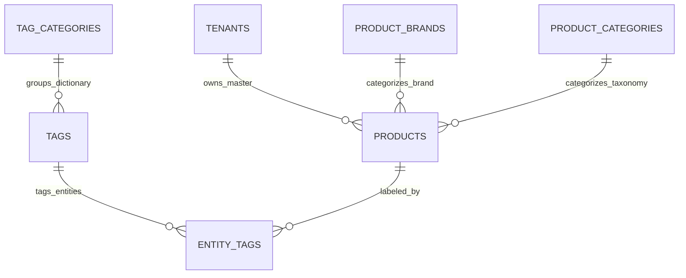

# Products & Tag Catalog — Data Model & Schema Specification

> **Module Schema Target**: `supabase/schemas/products/` and `supabase/schemas/tag/`  
> **Source Tables**: `products`, `product_brands`, `product_categories`, `tag_categories`, `tags`, `entity_tags`

---

## 1. Entity Relationship Diagram



---

## 2. Declarative SQL Schema & Types

### 2.1 Primary Database Tables

```sql
-- 1. Master Products Table
create table if not exists public.products (
  id uuid primary key default gen_random_uuid(),
  parent_tenant_id uuid not null references public.tenants(id) on delete cascade,
  inserted_by_tenant_id uuid references public.tenants(id) on delete set null,
  name text not null,
  product_code text not null,
  barcode text,
  brand_id uuid references public.product_brands(id) on delete set null,
  category_id uuid references public.product_categories(id) on delete set null,
  
  -- Sourcing & Price Specifications
  vendor_code text,
  market_code text default 'GB',
  list_price_amount numeric(14, 2) default 0,
  list_price_currency text default 'GBP',
  unit_weight_kg numeric(12, 3) default 0,
  minimum_order_quantity int default 1,
  available_units int default 0,
  
  -- Media & Visuals
  image_url text,
  metadata jsonb not null default '{}'::jsonb,
  is_active boolean not null default true,
  created_at timestamptz not null default now(),
  updated_at timestamptz not null default now(),
  constraint uq_product_code_per_tenant unique (parent_tenant_id, product_code)
);

-- 2. Master Brands
create table if not exists public.product_brands (
  id uuid primary key default gen_random_uuid(),
  parent_tenant_id uuid not null references public.tenants(id) on delete cascade,
  name text not null,
  slug text not null,
  logo_url text,
  created_at timestamptz not null default now(),
  constraint uq_brand_slug unique (parent_tenant_id, slug)
);

-- 3. Master Product Categories
create table if not exists public.product_categories (
  id uuid primary key default gen_random_uuid(),
  parent_tenant_id uuid not null references public.tenants(id) on delete cascade,
  parent_id uuid references public.product_categories(id) on delete cascade,
  name text not null,
  slug text not null,
  created_at timestamptz not null default now(),
  constraint uq_category_slug unique (parent_tenant_id, slug)
);

-- 4. Universal Tag Categories
create table if not exists public.tag_categories (
  id uuid primary key default gen_random_uuid(),
  tenant_id uuid references public.tenants(id) on delete cascade, -- NULL for platform presets
  module_key text not null, -- 'stock_grade', 'color', 'shipment_progress'
  name text not null,
  code text not null,
  is_system boolean not null default false,
  created_at timestamptz not null default now()
);

-- 5. Universal Tags Dictionary
create table if not exists public.tags (
  id uuid primary key default gen_random_uuid(),
  category_id uuid not null references public.tag_categories(id) on delete cascade,
  name text not null,
  slug text not null,
  color text,
  metadata jsonb not null default '{}'::jsonb,
  is_active boolean not null default true,
  created_at timestamptz not null default now()
);
```

---

## 3. Row Level Security (RLS) Policies

```sql
alter table public.products enable row level security;
alter table public.product_brands enable row level security;
alter table public.tags enable row level security;

create policy "Staff can view master products"
  on public.products for select
  using (
    parent_tenant_id in (
      select tm.tenant_id from public.tenant_members tm where tm.user_id = auth.uid()
    )
  );
```
