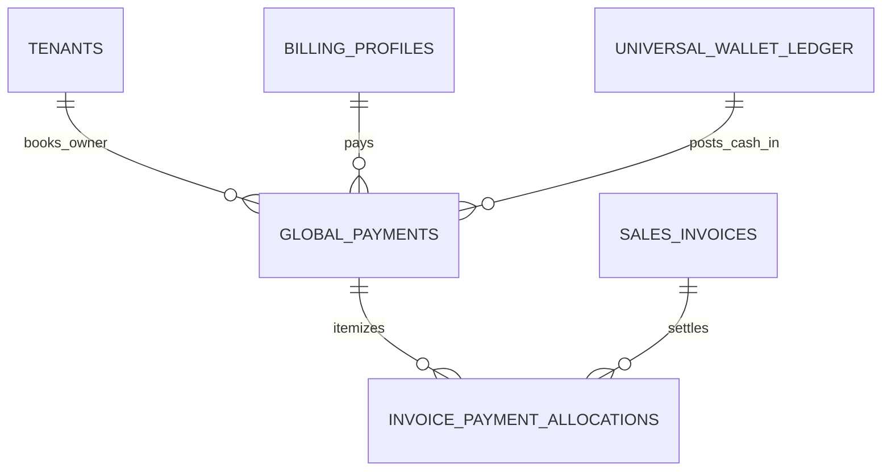

# Reporting & Treasury — Data Model & Schema Specification

> **Module Target**: Dynamic View Derivation & Payment Tables  
> **Source Schemas**: `supabase/schemas/sales_invoice/`, `supabase/schemas/procurement/`, `supabase/schemas/wallet/`

---

## 1. Entity Relationship Diagram



---

## 2. Declarative SQL Schema & Types

### 2.1 Domain Tables & Payment Ledger

```sql
-- 1. Consolidated Received Payments (Cash / Bank / Cheque)
create table if not exists public.global_payments (
  id uuid primary key default gen_random_uuid(),
  parent_tenant_id uuid not null references public.tenants(id) on delete cascade,
  operating_tenant_id uuid references public.tenants(id) on delete set null,
  billing_profile_id uuid references public.billing_profiles(id) on delete set null,
  payment_no text not null,
  payment_date date not null default current_date,
  amount numeric(16, 2) not null check (amount > 0),
  payment_method text not null, -- 'cash', 'bank_transfer', 'bkash', 'nagad', 'cheque', 'wallet_credit'
  reference_no text,
  notes text,
  metadata jsonb not null default '{}'::jsonb,
  created_by uuid references auth.users(id),
  created_at timestamptz not null default now(),
  constraint uq_payment_no_per_tenant unique (parent_tenant_id, payment_no)
);

-- 2. Payment Allocations against Invoices
create table if not exists public.invoice_payment_allocations (
  id uuid primary key default gen_random_uuid(),
  payment_id uuid not null references public.global_payments(id) on delete cascade,
  invoice_id uuid not null references public.sales_invoices(id) on delete cascade,
  allocated_amount numeric(16, 2) not null check (allocated_amount > 0),
  created_at timestamptz not null default now()
);

-- Performance Indexes
create index if not exists idx_payments_parent_date on public.global_payments(parent_tenant_id, payment_date desc);
create index if not exists idx_allocations_invoice on public.invoice_payment_allocations(invoice_id);
```

---

## 3. Row Level Security (RLS) Policies

```sql
alter table public.global_payments enable row level security;
alter table public.invoice_payment_allocations enable row level security;

create policy "Staff can view tenant payments"
  on public.global_payments for select
  using (
    parent_tenant_id in (
      select tm.tenant_id from public.tenant_members tm where tm.user_id = auth.uid()
    )
  );

create policy "Staff can view payment allocations"
  on public.invoice_payment_allocations for select
  using (
    payment_id in (
      select gp.id from public.global_payments gp
      where gp.parent_tenant_id in (
        select tm.tenant_id from public.tenant_members tm where tm.user_id = auth.uid()
      )
    )
  );
```
