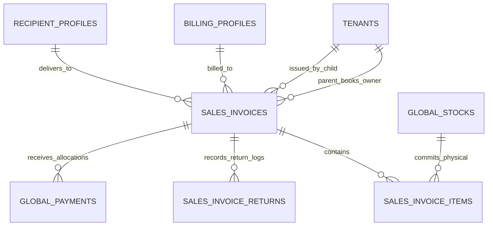

# Sales Invoice — Data Model & Schema Specification

> **Module Schema Target**: `supabase/schemas/sales_invoice/`  
> **Tables Target**: `supabase/schemas/sales_invoice/02_tables.sql`  
> **RLS Policies Target**: `supabase/schemas/sales_invoice/04_rls.sql`  
> **Types Target**: `supabase/schemas/sales_invoice/01_types.sql`  

---

## 1. Entity Relationship Diagram



---

## 2. Declarative SQL Schema & Types

### 2.1 Domain Enums

```sql
-- Multi-channel sales invoice types
create type public.sales_invoice_type as enum (
  'wholesale',
  'retail',
  'dropship'
);

-- Document lifecycle states
create type public.sales_invoice_status as enum (
  'draft',
  'proforma_generated',
  'issued',
  'voided'
);

-- Accounts receivable payment status
create type public.sales_invoice_payment_status as enum (
  'due',
  'partially_paid',
  'paid',
  'refunded'
);

-- Retail billing customer mode
create type public.retail_billing_mode as enum (
  'account',
  'direct'
);

-- Cash collection destination
create type public.invoice_collection_source as enum (
  'billing_profile',
  'recipient'
);
```

### 2.2 Primary Database Tables

```sql
-- 1. Sales Invoices Header
create table if not exists public.sales_invoices (
  id uuid primary key default gen_random_uuid(),
  parent_tenant_id uuid not null references public.tenants(id) on delete cascade,
  issued_by_tenant_id uuid not null references public.tenants(id) on delete cascade,
  invoice_type public.sales_invoice_type not null,
  invoice_no text not null,
  invoice_status public.sales_invoice_status not null default 'draft',
  payment_status public.sales_invoice_payment_status not null default 'due',
  
  -- Parties & Counterparts
  billing_profile_id uuid references public.billing_profiles(id) on delete set null,
  recipient_profile_id uuid references public.recipient_profiles(id) on delete set null,
  recipient_name text,
  recipient_phone text,
  recipient_address text,
  retail_billing_mode public.retail_billing_mode,
  collection_source public.invoice_collection_source not null default 'billing_profile',
  
  -- Dates
  invoice_date date not null default current_date,
  due_date date,
  
  -- Financial Breakdown
  subtotal_amount numeric(14, 2) not null default 0 check (subtotal_amount >= 0),
  discount_amount numeric(14, 2) not null default 0 check (discount_amount >= 0),
  shipping_charge numeric(14, 2) not null default 0 check (shipping_charge >= 0),
  cod_charge_amount numeric(14, 2) not null default 0 check (cod_charge_amount >= 0),
  print_charge numeric(14, 2) not null default 0 check (print_charge >= 0),
  wrapping_charge numeric(14, 2) not null default 0 check (wrapping_charge >= 0),
  return_credit_amount numeric(14, 2) not null default 0 check (return_credit_amount >= 0),
  settlement_amount numeric(14, 2) not null default 0 check (settlement_amount >= 0),
  total_amount numeric(14, 2) not null default 0 check (total_amount >= 0),
  paid_amount numeric(14, 2) not null default 0 check (paid_amount >= 0),
  due_amount numeric(14, 2) not null default 0 check (due_amount >= 0),
  
  -- Audit & Metadata
  note text,
  created_by uuid references auth.users(id),
  created_at timestamptz not null default now(),
  updated_at timestamptz not null default now(),
  
  constraint uq_invoice_no_per_tenant unique (parent_tenant_id, invoice_no)
);

-- 2. Sales Invoice Line Items
create table if not exists public.sales_invoice_items (
  id uuid primary key default gen_random_uuid(),
  parent_tenant_id uuid not null references public.tenants(id) on delete cascade,
  invoice_id uuid not null references public.sales_invoices(id) on delete cascade,
  global_stock_id uuid not null references public.global_stocks(id),
  product_id uuid references public.products(id) on delete set null,
  
  -- Quantities (Sold vs Returned)
  quantity numeric(12, 3) not null check (quantity > 0),
  return_quantity numeric(12, 3) not null default 0 check (return_quantity >= 0 and return_quantity <= quantity),
  
  -- Pricing & Line Totals
  sell_price_amount numeric(14, 2) not null check (sell_price_amount >= 0),
  line_discount_amount numeric(14, 2) not null default 0 check (line_discount_amount >= 0),
  line_total_amount numeric(14, 2) not null check (line_total_amount >= 0),
  
  -- Landed Cost Snapshot (Frozen at Issue Time)
  unit_cost_price numeric(14, 2) not null default 0,
  
  -- Snapshots for Voucher Printing
  name_snapshot text not null,
  barcode_snapshot text,
  product_code_snapshot text,
  
  created_at timestamptz not null default now(),
  updated_at timestamptz not null default now()
);

-- 3. Invoice Concurrency Counter (Collision-free sequence)
create table if not exists public.sales_invoice_counters (
  tenant_id uuid not null references public.tenants(id) on delete cascade,
  counter_date date not null,
  invoice_type public.sales_invoice_type not null,
  last_seq int not null default 0,
  primary key (tenant_id, counter_date, invoice_type)
);
```

---

## 3. Row Level Security (RLS) Policies

```sql
alter table public.sales_invoices enable row level security;
alter table public.sales_invoice_items enable row level security;

create policy "Staff can view parent/child tenant invoices"
  on public.sales_invoices for select
  using (
    parent_tenant_id in (
      select tm.tenant_id from public.tenant_members tm where tm.user_id = auth.uid()
    ) or
    issued_by_tenant_id in (
      select tm.tenant_id from public.tenant_members tm where tm.user_id = auth.uid()
    )
  );
```
