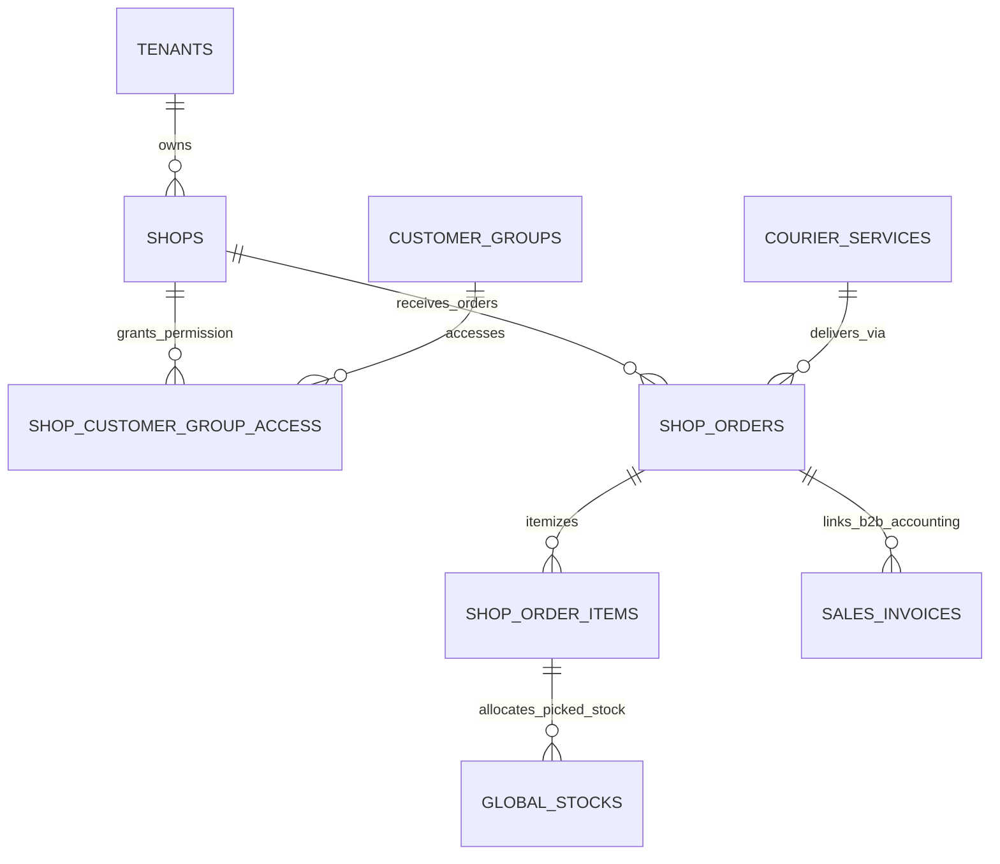

# Shop Order & Dropship — Data Model & Schema Specification

> **Module Schema Target**: `supabase/schemas/shop_order/`  
> **Tables Target**: `supabase/schemas/shop_order/02_tables.sql`  
> **RLS Policies Target**: `supabase/schemas/shop_order/04_rls.sql`  
> **Types Target**: `supabase/schemas/shop_order/01_types.sql`  

---

## 1. Entity Relationship Diagram



---

## 2. Declarative SQL Schema & Types

### 2.1 Domain Enums

```sql
-- Storefront operation model
create type public.shop_type_enum as enum (
  'vendor_catalog',
  'fixed_price',
  'dropship'
);

-- Storefront order status lifecycle
create type public.shop_order_status as enum (
  'submitted',
  'priced',
  'countered',
  'final_offered',
  'confirmed',
  'procuring',
  'ready_for_shipment',
  'ready_for_pickup',
  'processing',
  'in_transit',
  'delivered',
  'cancelled'
);

-- Negotiation line item response
create type public.negotiation_action_type as enum (
  'accept',
  'counter',
  'reject'
);
```

### 2.2 Primary Database Tables

```sql
-- 1. Storefront Configuration
create table if not exists public.shops (
  id uuid primary key default gen_random_uuid(),
  tenant_id uuid not null references public.tenants(id) on delete cascade,
  name text not null,
  slug text not null,
  shop_type public.shop_type_enum not null,
  is_active boolean not null default true,
  is_negotiable boolean not null default false,
  vendor_filters jsonb default '[]'::jsonb,
  category_ids uuid[] default '{}'::uuid[],
  created_at timestamptz not null default now(),
  updated_at timestamptz not null default now(),
  constraint uq_shop_slug_per_tenant unique (tenant_id, slug)
);

-- 2. Customer Group Access & Price Permissions
create table if not exists public.shop_customer_group_access (
  id uuid primary key default gen_random_uuid(),
  shop_id uuid not null references public.shops(id) on delete cascade,
  customer_group_id uuid not null references public.customer_groups(id) on delete cascade,
  can_browse boolean not null default true,
  can_see_buy_price boolean not null default false,
  can_see_sell_price boolean not null default true,
  can_see_resell_minimum_price boolean not null default false,
  can_negotiate boolean not null default false,
  can_order boolean not null default true,
  created_at timestamptz not null default now(),
  constraint uq_group_per_shop unique (shop_id, customer_group_id)
);

-- 3. Storefront / Dropship Orders
create table if not exists public.shop_orders (
  id uuid primary key default gen_random_uuid(),
  tenant_id uuid not null references public.tenants(id) on delete cascade,
  shop_id uuid not null references public.shops(id) on delete cascade,
  customer_group_id uuid references public.customer_groups(id) on delete set null,
  billing_profile_id uuid references public.billing_profiles(id) on delete set null,
  order_no text not null,
  status public.shop_order_status not null default 'submitted',
  
  -- Order Type & Channel
  is_dropship boolean not null default false,
  is_negotiable_snapshot boolean not null default false,
  
  -- Recipient Delivery Snapshot
  recipient_name text,
  recipient_phone text,
  recipient_address text,
  courier_id uuid references public.courier_services(id) on delete set null,
  courier_awb text,
  
  -- Pricing & Totals
  wholesale_total_amount numeric(14, 2) default 0,
  resell_total_amount numeric(14, 2) default 0,
  delivery_charge numeric(14, 2) default 0,
  cod_charge numeric(14, 2) default 0,
  reseller_profit_amount numeric(14, 2) default 0,
  profit_settled boolean not null default false,
  
  -- Accounting Invoice Link
  global_invoice_id uuid references public.sales_invoices(id) on delete set null,
  
  created_by uuid references auth.users(id),
  created_at timestamptz not null default now(),
  updated_at timestamptz not null default now(),
  constraint uq_order_no_per_tenant unique (tenant_id, order_no)
);

-- 4. Shop Order Line Items
create table if not exists public.shop_order_items (
  id uuid primary key default gen_random_uuid(),
  shop_order_id uuid not null references public.shop_orders(id) on delete cascade,
  product_id uuid references public.products(id) on delete set null,
  global_stock_id uuid references public.global_stocks(id) on delete set null,
  
  -- Quantities
  ordered_quantity numeric(12, 3) not null check (ordered_quantity > 0),
  confirmed_quantity numeric(12, 3),
  picked_quantity numeric(12, 3) default 0,
  
  -- Prices
  unit_cost_price numeric(14, 2),
  wholesale_price numeric(14, 2),
  resell_price numeric(14, 2),
  first_offer_price numeric(14, 2),
  customer_counter_price numeric(14, 2),
  final_offer_price numeric(14, 2),
  
  created_at timestamptz not null default now()
);
```

---

## 3. Row Level Security (RLS) Policies

```sql
alter table public.shops enable row level security;
alter table public.shop_orders enable row level security;
alter table public.shop_order_items enable row level security;

create policy "Staff can manage tenant shops"
  on public.shops for all
  using (
    tenant_id in (
      select tm.tenant_id from public.tenant_members tm where tm.user_id = auth.uid()
    )
  );
```
