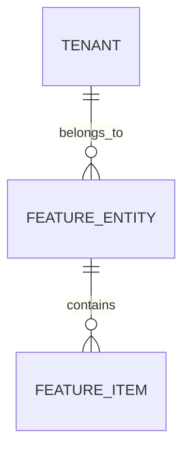

> **Keep.** Understand tables. Max ~80 lines. Do not paste live SQL — link `schemas/`. Files: `01_types`, `02_tables`, `03_rpcs`, `04_rls`.

# [Feature Name] — Data Model & Schema Specification

> **Module Schema Target**: `supabase/schemas/<domain>/02_tables.sql`  
> **RLS Policies Target**: `supabase/schemas/<domain>/04_rls.sql`  

---

## 1. Entity Relationship Diagram



---

## 2. Declarative SQL Schema

```sql
-- Custom Status Enum
create type public.feature_status as enum (
  'draft',
  'active',
  'completed',
  'cancelled'
);

-- Primary Table
create table if not exists public.feature_entities (
  id uuid primary key default gen_random_uuid(),
  tenant_id uuid not null references public.tenants(id) on delete cascade,
  title text not null,
  status public.feature_status not null default 'draft',
  metadata jsonb not null default '{}'::jsonb,
  created_at timestamptz not null default now(),
  updated_at timestamptz not null default now()
);

-- Performance Indexes
create index ifcast_feature_tenant_idx on public.feature_entities(tenant_id, status);
create index ifcast_feature_metadata_gin on public.feature_entities using gin (metadata);
```

---

## 3. Row Level Security (RLS) Policies

```sql
alter table public.feature_entities enable row level security;

create policy "Users can view tenant entities"
  on public.feature_entities for select
  using (
    tenant_id in (
      select tenant_id from public.tenant_members where user_id = auth.uid()
    )
  );
```
