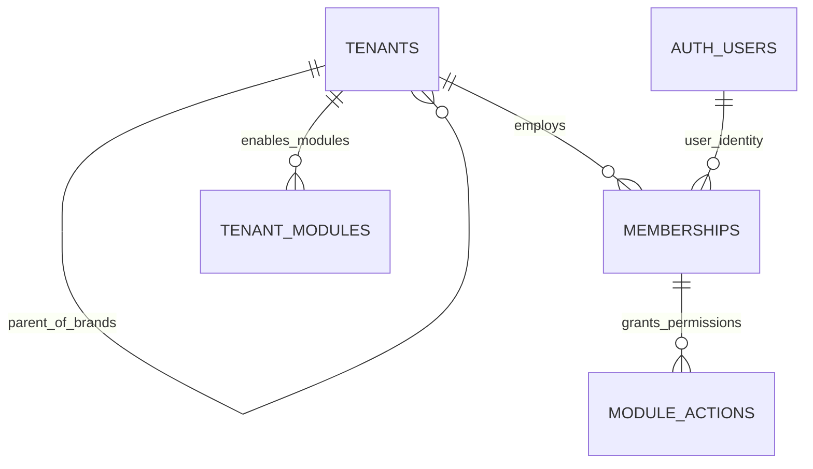

# Tenant Auth & Access Control — Data Model & Schema Specification

> **Module Schema Target**: `supabase/schemas/tenants/` and `supabase/schemas/permissions/`  
> **Source Tables**: `tenants`, `memberships`, `tenant_modules`, `module_actions`, `tenant_features`

---

## 1. Entity Relationship Diagram



---

## 2. Declarative SQL Schema & Types

### 2.1 Domain Enums

```sql
-- Staff membership roles
create type public.membership_role as enum (
  'admin',
  'staff',
  'investor'
);

-- Granular module action grants
create type public.module_action_grant as enum (
  'view',
  'create',
  'edit',
  'delete',
  'manage'
);
```

### 2.2 Primary Database Tables

```sql
-- 1. Multi-Tenant Organizations (Company vs Brand)
create table if not exists public.tenants (
  id uuid primary key default gen_random_uuid(),
  parent_id uuid references public.tenants(id) on delete cascade, -- NULL for Company, set for Brand
  name text not null,
  slug text not null unique,
  public_domain text unique,
  logo_url text,
  is_active boolean not null default true,
  created_at timestamptz not null default now(),
  updated_at timestamptz not null default now(),
  
  -- Single-Tier Constraint Check
  constraint chk_single_tier_depth check (
    parent_id is null or parent_id <> id
  )
);

-- 2. Staff User Memberships
create table if not exists public.memberships (
  id uuid primary key default gen_random_uuid(),
  tenant_id uuid not null references public.tenants(id) on delete cascade,
  user_id uuid not null references auth.users(id) on delete cascade,
  role public.membership_role not null default 'staff',
  is_active boolean not null default true,
  created_at timestamptz not null default now(),
  constraint uq_tenant_user unique (tenant_id, user_id)
);

-- 3. Tenant-Level Enabled Modules
create table if not exists public.tenant_modules (
  id uuid primary key default gen_random_uuid(),
  tenant_id uuid not null references public.tenants(id) on delete cascade,
  module_key text not null, -- 'procurement', 'sales_invoice', 'shop_order', 'wallet', 'reporting'
  is_enabled boolean not null default true,
  created_at timestamptz not null default now(),
  constraint uq_tenant_module unique (tenant_id, module_key)
);

-- 4. Granular Staff Action Grants
create table if not exists public.module_actions (
  id uuid primary key default gen_random_uuid(),
  membership_id uuid not null references public.memberships(id) on delete cascade,
  module_key text not null,
  actions public.module_action_grant[] not null default '{view}',
  created_at timestamptz not null default now(),
  constraint uq_member_module unique (membership_id, module_key)
);
```

---

## 3. Row Level Security (RLS) Policies

```sql
alter table public.tenants enable row level security;
alter table public.memberships enable row level security;
alter table public.tenant_modules enable row level security;
alter table public.module_actions enable row level security;

create policy "Users can view assigned tenants"
  on public.tenants for select
  using (
    id in (
      select m.tenant_id from public.memberships m where m.user_id = auth.uid()
    ) or
    parent_id in (
      select m.tenant_id from public.memberships m where m.user_id = auth.uid()
    )
  );
```
