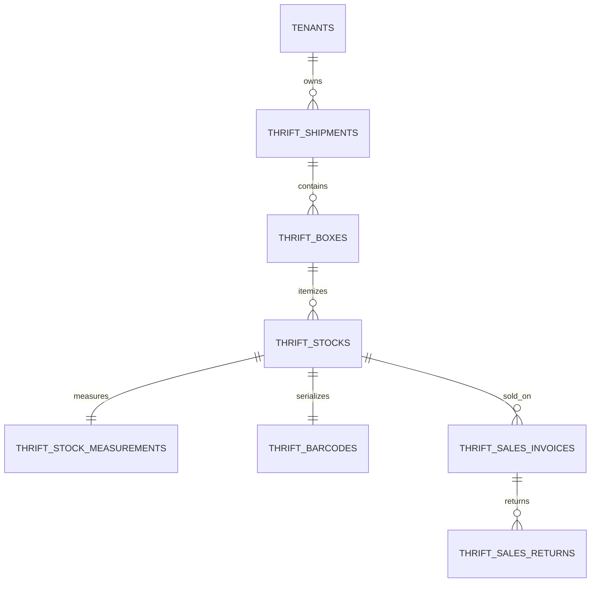

# Thrift Vertical — Data Model & Schema Specification

> **Module Schema Target**: `supabase/schemas/thrift/`  
> **Source Tables**: `thrift_shipments`, `thrift_boxes`, `thrift_stocks`, `thrift_stock_measurements`, `thrift_barcodes`, `thrift_sales_invoices`, `thrift_sales_returns`

---

## 1. Entity Relationship Diagram



---

## 2. Declarative SQL Schema & Types

### 2.1 Domain Enums

```sql
-- Thrift stock inventory status
create type public.thrift_stock_status as enum (
  'registered',
  'tagged',
  'in_stock',
  'reserved',
  'sold',
  'damaged',
  'returned'
);

-- Thrift sales invoice status
create type public.thrift_invoice_status as enum (
  'draft',
  'confirmed',
  'dispatched',
  'delivered',
  'returned',
  'cancelled'
);
```

### 2.2 Primary Database Tables

```sql
-- 1. Inbound Thrift Shipments
create table if not exists public.thrift_shipments (
  id uuid primary key default gen_random_uuid(),
  tenant_id uuid not null references public.tenants(id) on delete cascade,
  shipment_no text not null,
  total_weight_kg numeric(12, 3) default 0,
  cargo_cost_bdt numeric(14, 2) default 0,
  origin_cost_bdt numeric(14, 2) default 0,
  other_cost_bdt numeric(14, 2) default 0,
  total_landed_cost_bdt numeric(14, 2) default 0,
  status text not null default 'draft',
  created_at timestamptz not null default now(),
  constraint uq_thrift_shipment_no unique (tenant_id, shipment_no)
);

-- 2. Unique Single-Piece Thrift Stock
create table if not exists public.thrift_stocks (
  id uuid primary key default gen_random_uuid(),
  tenant_id uuid not null references public.tenants(id) on delete cascade,
  shipment_id uuid references public.thrift_shipments(id) on delete set null,
  barcode text not null unique,
  name text not null,
  brand text,
  category text not null,
  size text,
  color text,
  condition_grade text default 'good',
  weight_kg numeric(12, 3) not null default 0.3,
  
  -- Landed Cost & Retail Pricing
  origin_price_bdt numeric(14, 2) not null default 0,
  cargo_share_bdt numeric(14, 2) not null default 0,
  landed_cost_bdt numeric(14, 2) not null default 0,
  retail_price_bdt numeric(14, 2) not null default 0,
  
  status public.thrift_stock_status not null default 'registered',
  shelf_location text,
  created_at timestamptz not null default now(),
  updated_at timestamptz not null default now()
);

-- 3. Garment Physical Measurements (Inches)
create table if not exists public.thrift_stock_measurements (
  id uuid primary key default gen_random_uuid(),
  stock_id uuid not null unique references public.thrift_stocks(id) on delete cascade,
  garment_type text not null, -- 'top', 'bottom', 'outerwear', 'dress'
  
  -- Tops / Outerwear
  chest numeric(6, 2),
  body_length numeric(6, 2),
  shoulder numeric(6, 2),
  sleeve numeric(6, 2),
  
  -- Bottoms
  waist numeric(6, 2),
  inseam numeric(6, 2),
  outseam numeric(6, 2),
  rise numeric(6, 2),
  thigh numeric(6, 2),
  leg_opening numeric(6, 2),
  
  created_at timestamptz not null default now()
);

-- 4. POS Sales Invoices
create table if not exists public.thrift_sales_invoices (
  id uuid primary key default gen_random_uuid(),
  tenant_id uuid not null references public.tenants(id) on delete cascade,
  invoice_no text not null,
  customer_name text not null,
  customer_phone text not null,
  delivery_address text,
  courier_id uuid references public.courier_services(id) on delete set null,
  courier_consignment_id text,
  
  -- Financials
  subtotal_amount numeric(14, 2) not null check (subtotal_amount >= 0),
  discount_amount numeric(14, 2) not null default 0,
  delivery_charge numeric(14, 2) not null default 0,
  total_amount numeric(14, 2) not null check (total_amount >= 0),
  cod_amount numeric(14, 2) not null default 0,
  
  status public.thrift_invoice_status not null default 'confirmed',
  created_at timestamptz not null default now(),
  constraint uq_thrift_invoice_no unique (tenant_id, invoice_no)
);
```

---

## 3. Row Level Security (RLS) Policies

```sql
alter table public.thrift_stocks enable row level security;
alter table public.thrift_sales_invoices enable row level security;

create policy "Staff can view tenant thrift stocks"
  on public.thrift_stocks for select
  using (
    tenant_id in (
      select tm.tenant_id from public.tenant_members tm where tm.user_id = auth.uid()
    )
  );
```
