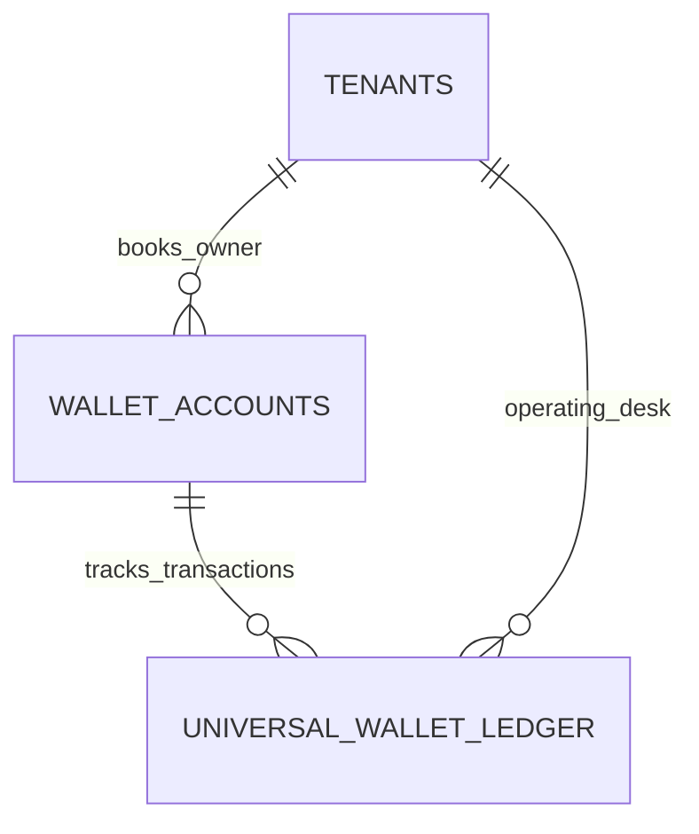

# Universal Wallet & Ledger — Data Model & Schema Specification

> **Module Schema Target**: `supabase/schemas/wallet/`  
> **Tables Target**: `supabase/schemas/wallet/02_tables.sql`  
> **RLS Policies Target**: `supabase/schemas/wallet/04_rls.sql`  
> **Types Target**: `supabase/schemas/wallet/01_types.sql`  

---

## 1. Entity Relationship Diagram



---

## 2. Declarative SQL Schema & Types

### 2.1 Domain Enums

```sql
-- Entity counterparty types
create type public.wallet_entity_type as enum (
  'tenant',
  'vendor',
  'courier',
  'customer',
  'middleman',
  'cargo_company',
  'investor'
);

-- Transaction entry direction
create type public.ledger_entry_direction as enum (
  'credit',
  'debit'
);
```

### 2.2 Primary Database Tables

```sql
-- 1. Universal Wallet Accounts (One per entity per currency)
create table if not exists public.wallet_accounts (
  id uuid primary key default gen_random_uuid(),
  parent_tenant_id uuid not null references public.tenants(id) on delete cascade,
  entity_type public.wallet_entity_type not null,
  entity_id uuid not null,
  currency_code text not null default 'BDT',
  current_balance numeric(16, 2) not null default 0,
  unsettled_balance numeric(16, 2) not null default 0,
  is_active boolean not null default true,
  created_at timestamptz not null default now(),
  updated_at timestamptz not null default now(),
  constraint uq_wallet_account unique (parent_tenant_id, entity_type, entity_id, currency_code)
);

-- 2. Immutable Universal Wallet Ledger (Append-Only)
create table if not exists public.universal_wallet_ledger (
  id uuid primary key default gen_random_uuid(),
  wallet_account_id uuid not null references public.wallet_accounts(id) on delete cascade,
  parent_tenant_id uuid not null references public.tenants(id) on delete cascade,
  operating_tenant_id uuid references public.tenants(id) on delete set null,
  
  -- Direction & Amounts
  entry_direction public.ledger_entry_direction not null,
  amount numeric(16, 2) not null check (amount > 0),
  balance_before numeric(16, 2) not null,
  balance_after numeric(16, 2) not null,
  
  -- Transaction Metadata & Attribution
  transaction_type text not null, -- 'cash_in', 'payout', 'store_credit_apply', 'dropship_profit', 'courier_cod', 'manual_adjustment'
  source_type text, -- 'sales_invoice', 'shop_order', 'global_shipment', 'payment'
  source_id uuid,
  reference_no text,
  notes text,
  metadata jsonb not null default '{}'::jsonb,
  
  created_by uuid references auth.users(id),
  created_at timestamptz not null default now()
);

-- Indexes for performance & auditing
create index if not exists idx_wallet_ledger_account on public.universal_wallet_ledger(wallet_account_id, created_at desc);
create index if not exists idx_wallet_ledger_parent on public.universal_wallet_ledger(parent_tenant_id, created_at desc);
```

---

## 3. Row Level Security (RLS) Policies

```sql
alter table public.wallet_accounts enable row level security;
alter table public.universal_wallet_ledger enable row level security;

create policy "Staff can view tenant wallet accounts"
  on public.wallet_accounts for select
  using (
    parent_tenant_id in (
      select tm.tenant_id from public.tenant_members tm where tm.user_id = auth.uid()
    )
  );

create policy "Staff can view tenant wallet ledger"
  on public.universal_wallet_ledger for select
  using (
    parent_tenant_id in (
      select tm.tenant_id from public.tenant_members tm where tm.user_id = auth.uid()
    )
  );
```
