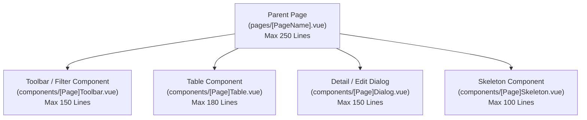

# UI — tokens and ops list layout

Canonical UI file. New UI notes go here or in a module `01-prd`, not a second guide. Law: [STRUCTURE](../STRUCTURE.md).

---

## 🎨 1. Design Tokens & Color Palette

### 1.1 Neutrals & Background Surfaces
| Token | Light Mode (`:root`) | Dark Mode (`body.body--dark`) | Usage |
| :--- | :--- | :--- | :--- |
| `--bw-neutral-canvas` | `#fbfaf7` | `#141210` | Page canvas background |
| `--bw-neutral-surface` | `#ffffff` | `#1c1917` | Card / Table surface |
| `--bw-neutral-border` | `#e7e1d8` | `#2a2622` | Borders and dividers |
| `--bw-neutral-ink` | `#171412` | `#f5f5f4` | Primary typography |
| `--bw-neutral-muted` | `#736a61` | `#a8a29e` | Subtitles and captions |
| `--bw-neutral-chrome` | `#64748b` | `#94a3b8` | Table column headers, overlines |

- **Default Unscoped Accent**: `--bw-brand-accent` $\to$ `#0d6b5c` (Trade Teal)

### 1.2 Semantic State Hues
| Status Token | Light Color | Dark Color | Status Meaning |
| :--- | :--- | :--- | :--- |
| `--bw-success` | `#1a7f4b` | `#4ade80` | Paid, posted, completed, in stock |
| `--bw-warning` | `#b45309` | `#fbbf24` | Pending, draft, awaiting review |
| `--bw-error` | `#b83a3a` | `#f87171` | Voided, failed, rejected, overdue |
| `--bw-info` | `#2563eb` | `#60a5fa` | Info banners, links, notices |

- **Row & Badge Soft Tints**: Apply soft background tints (`10% - 15%` color-mix on surface) with inset left accent borders (`box-shadow: inset 3px 0 0 var(--color)`).

---

## 📐 2. Page Container & Layout Standard

All operational dashboard and list pages must adhere to the **Non-Scrolling Page Container** architecture:

```html
<template>
  <!-- 1. Locked Non-Scrolling Outer Container -->
  <q-page class="column no-wrap" style="height: calc(100vh - 55px); overflow: hidden">
    
    <!-- 2. Compact Table Toolbar (Zero in-page H1 headers) -->
    <div class="row items-center justify-between q-px-md q-py-xs bg-surface border-bottom shrink-0">
      <div class="row items-center q-gutter-sm">
        <q-input v-model="search" outlined rounded dense placeholder="Search items..." class="table-search" />
        <q-btn-toggle v-model="statusFilter" dense unelevated rounded :options="statusOptions" />
      </div>
      <div class="row items-center q-gutter-sm">
        <q-btn unelevated color="primary" label="New Record" style="border-radius: 8px" />
      </div>
    </div>

    <!-- 3. Scrollable Middle Table Canvas -->
    <div class="col overflow-auto bg-surface" style="overflow-y: auto">
      <q-markup-table flat class="sticky-header-table full-width">
        <thead class="sticky-th">...</thead>
        <tbody>...</tbody>
      </q-markup-table>
    </div>
  </q-page>
</template>
```

Copy **`InboundShipmentListPage.vue`**, not overview pages with `AppPageHeader`.

### Layout Rules:
1. **Zero In-Page Headers**: Never render redundant in-page `<h1>` or `text-overline` banner blocks. Top breadcrumbs provide context and page titles.
2. **Fixed Viewport**: Page height locked to `calc(100vh - 55px)` with `overflow: hidden`.
3. **Internal Table Scroll**: Sticky table headers (`thead tr th`) with internal scrolling body container.
4. **Rounded Square Buttons**: Primary actions use `border-radius: 8px`, not pill shapes.

---

## 📊 3. Ops Spreadsheet & Dense Table Pattern

| Column Role | Header Width (`th`) | Body Cell (`td`) | Input Control | Alignment & Style |
| :--- | :---: | :---: | :---: | :--- |
| **Selection Checkbox** | `24px` | `24px` | — | `text-center`, dense checkbox |
| **Sequence / SL** | `36px` | `36px` | `max-width: 32px` | `text-center`, borderless editable |
| **Thumbnail** | `72px` | `72px` | — | Square thumbnail with soft radius |
| **Product / Entity Title** | `160px` | `160px` | — | Left-aligned, multi-line wrap |
| **Monospace Codes / IDs** | `110px` | `110px` | — | Monospace font with 1-click copy |
| **Prices / Financials** | `70px` | `70px` | `max-width: 60px` | `text-right`, soft tinted background |
| **Quantity / Numeric** | `56px` | `56px` | `max-width: 50px` | `text-center`, numeric input |
| **Actions** | `60px` | `60px` | — | `text-center`, ghost icon buttons |

---

## 🧩 4. Component Modularization & File Limits

To ensure high performance, maintainability, and clean AI context budgeting:



### File Size Limits:
- **Parent Page (`pages/[Name].vue`)**: Target **150 – 180 lines** (Strict Max: **250 lines**). Orchestrates queries, routes, and layout grids.
- **Sub-Component (`components/[Name].vue`)**: Target **80 – 120 lines** (Strict Max: **180 lines**). Presentation blocks with explicit `defineProps` & `defineEmits`.
- **Composable (`composables/use[Name].ts`)**: Target **50 – 100 lines** (Strict Max: **150 lines**). Reactive logic and calculation helpers.

### Refactoring Protocol (For Large Files):
1. **One Component Per Turn**: Extract exactly ONE visual section per refactoring cycle.
2. **Surgical Template Edits**: Extract template HTML and scoped styles; avoid rewriting parent state logic.
3. **Explicit Props/Emits**: Pass existing reactive refs as props rather than creating complex new state trees.

---

## 💀 5. Skeleton Loaders & Zero Cumulative Layout Shift (CLS)

1. **Zero CLS Guarantee**: Skeleton loaders must exactly replicate the dimensions, heights, and spacing (`q-gutter-y-md`) of the loaded UI.
2. **Dedicated Skeleton Components**: Never inline giant skeleton blocks in parent pages. Extract to `components/[Feature]Skeleton.vue`.
3. **Element Dimensions**:
   - Primary CTA: `<q-skeleton type="QBtn" width="110px" height="36px" />`
   - Search Field: `<q-skeleton type="QInput" height="38px" />`
   - Table Row: `<q-skeleton type="text" width="90%" height="28px" />`
   - Badge: `<q-skeleton type="QBadge" width="70px" height="22px" />`
4. **Skeletons Over Spinners**: Always use `q-skeleton` for initial page loads to preserve layout context; use `QSpinner` only on micro-actions.
